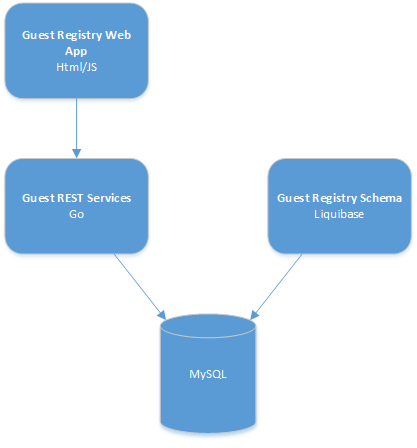

# Hands on with Guestbook app
The guestbook app is just a simple 3-tier web application stack, which is defined in a [docker-compose.yml](docker-compose.yml) file. It is comprised of
a Nginx web server hosting the application static content, a REST service which communicates with a MySQL server for data persistence.



## Building the app
Start by compiling the `go` rest service:
```
GOOS=linux bash build
```
## Build and start the containers
When `docker-compose up` is executed, Docker will build any images that need to be built
before the containers are started.
```
docker-compose up -d
```
After the containers are started the application is available at `http://localhost`